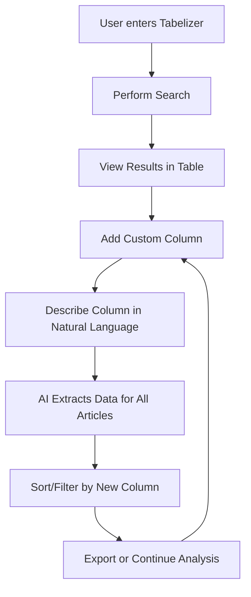

# Tabelizer Feature Design Specification

**Document ID:** 12_tabelizer_design.md  
**Version:** 1.0  
**Date:** 2025-07-24  
**Author:** System Design  

## Overview

The Tabelizer is a new top-level feature alongside the Workbench that provides a table-based interface for research article analysis. It allows users to search for articles, view results in a structured table format, and dynamically add custom columns with AI-powered data extraction.

## Core Concept

1. **Search & Display**: Users perform unified searches (PubMed, Google Scholar) with results displayed in a sortable, filterable table
2. **Dynamic Column Addition**: Users can add custom columns by describing what they want to extract in natural language
3. **AI-Powered Extraction**: Each custom column uses LLM prompts to extract specific information from articles
4. **Data Analysis**: Users can sort, filter, and analyze the extracted data across all articles

## User Journey



## Feature Requirements

### 1. Core Table Features

#### Base Columns (Always Present)
- **PMID/ID**: Article identifier
- **Title**: Full article title (truncated with hover for full text)
- **Authors**: Author list (truncated with hover)
- **Journal**: Publication venue
- **Year**: Publication year
- **Source**: PubMed/Scholar badge
- **Actions**: View full article, export, etc.

#### Table Functionality
- **Sorting**: Click any column header to sort ascending/descending
- **Filtering**: Global search box + per-column filters
- **Pagination**: Handle large result sets (100+ articles)
- **Selection**: Checkbox selection for bulk operations
- **Responsive Design**: Mobile-friendly table with horizontal scroll

### 2. Custom Column System

#### Column Creation Flow
1. **Add Column Button**: Prominent button to add new column
2. **Column Configuration Modal**:
   - Column Name (user-defined)
   - Description/Prompt (natural language)
   - Expected Output Type (text, yes/no, number, category)
   - Example values (optional, for better prompting)

#### Column Types
- **Boolean**: "Does this article discuss X?" → Yes/No
- **Category**: "What type of study is this?" → RCT/Observational/Review/etc.
- **Text**: "What is the main finding?" → Free text summary
- **Number**: "How many participants?" → Numeric value
- **Scale**: "Rate clinical relevance 1-5" → 1-5 scale

#### AI Extraction Process
- **Batch Processing**: Extract data for all articles simultaneously
- **Progress Indicator**: Show extraction progress with cancel option
- **Error Handling**: Handle failed extractions gracefully
- **Caching**: Cache results to avoid re-extraction

### 3. Search Integration

#### Unified Search Support
- Leverage existing unified search infrastructure
- Support both PubMed and Google Scholar
- Maintain search parameters and filters
- Allow search refinement without losing custom columns

#### Search Parameters
- **Query**: Free text search
- **Providers**: PubMed, Scholar, or both
- **Date Range**: Publication date filtering
- **Result Limit**: Number of articles to retrieve
- **Sort Order**: Relevance or date

## Technical Architecture

### Integration with Existing Services

#### Unified Search Service Integration
The Tabelizer will leverage the existing unified search infrastructure:

- **Frontend**: Use `unifiedSearchApi.ts` from `frontend/src/lib/api/`
- **Backend**: Use existing `/api/unified-search/search` endpoint
- **Types**: Use `CanonicalResearchArticle` from `frontend/src/types/unifiedSearch.ts`
- **Search Providers**: Leverage existing `SearchProviderRegistry` for PubMed/Scholar

```typescript
// Example: Reusing existing search
import { unifiedSearchApi } from '@/lib/api';
import { UnifiedSearchParams } from '@/types/unifiedSearch';

const searchResults = await unifiedSearchApi.search({
  provider: 'pubmed',
  query: searchQuery,
  num_results: 50,
  // ... other params
});
```

#### Extraction Service Integration
The Tabelizer will build upon the existing extraction infrastructure:

- **Backend Service**: Extend `backend/services/extraction_service.py`
- **Tool Handlers**: Create new handlers in `backend/tools/handlers/`
- **Schemas**: Define column extraction schemas similar to `scholar_features.py` and `pubmed_features.py`

```python
# New handler: backend/tools/handlers/tabelizer_handlers.py
class TabelizerColumnHandler(BaseToolHandler):
    """Handle custom column extraction for Tabelizer"""
    
    async def extract_column_value(
        self, 
        article: CanonicalResearchArticle,
        column_definition: dict
    ) -> dict:
        # Use existing extraction patterns
        prompt = self._build_extraction_prompt(article, column_definition)
        return await self.llm_service.extract_with_schema(
            prompt=prompt,
            schema=self._get_column_schema(column_definition)
        )
```

### Frontend Components & Reusable Elements

The Tabelizer will maximize reuse of existing components:

#### Reused Components
- **Search**: `UnifiedSearchControls` from workbench for search interface
- **Article Display**: Adapt `UnifiedArticleCard` for table row expansion
- **Loading States**: Use existing `Loader2` patterns
- **Modals**: Use existing `Dialog` component from `@/components/ui`
- **Toast Notifications**: Use existing toast system for feedback
- **Badge Component**: For source indicators (PubMed/Scholar)

#### New Components Structure
```
src/components/features/tabelizer/
├── TabelizerPage.tsx           # Main page component
├── TabelizerProvider.tsx       # Context provider for state management
├── search/
│   ├── TabelizerSearch.tsx     # Wrapper around UnifiedSearchControls
│   └── SearchResultsLoader.tsx # Handles search result integration
├── table/
│   ├── TabelizerTable.tsx      # Main table component
│   ├── TableHeader.tsx         # Column headers with sorting
│   ├── TableRow.tsx            # Individual article row
│   ├── TableCell.tsx           # Individual cell component
│   ├── TableFilters.tsx        # Per-column filtering
│   └── TablePagination.tsx     # Pagination controls
├── columns/
│   ├── ColumnManager.tsx       # Custom column management
│   ├── AddColumnModal.tsx      # Column creation dialog
│   ├── EditColumnModal.tsx     # Column editing dialog
│   ├── ColumnExtractor.tsx     # Manages extraction process
│   └── ColumnTemplates.tsx     # Pre-built column templates
└── utils/
    ├── columnTypes.ts          # Column type definitions
    ├── extractionHooks.ts      # React hooks for extraction
    └── tableUtils.ts           # Table utility functions
```

#### Shared Utilities
```typescript
// Reuse existing API clients
import { unifiedSearchApi } from '@/lib/api';
import { useToast } from '@/components/ui/use-toast';

// Reuse existing types
import { 
  CanonicalResearchArticle,
  UnifiedSearchParams,
  SearchProvider 
} from '@/types/unifiedSearch';

// Reuse existing hooks
import { useDebounce } from '@/lib/hooks/useDebounce';
```

### Backend API Endpoints

Extend existing APIs rather than creating entirely new ones:

```
# Extend existing extraction endpoints
/api/extraction/
├── POST /tabelizer-column      # Extract single column data
├── POST /tabelizer-batch       # Batch extract for multiple articles

# New tabelizer-specific endpoints
/api/tabelizer/
├── GET /sessions               # List saved table sessions
├── POST /sessions              # Save table session
├── PUT /sessions/{id}          # Update session
├── DELETE /sessions/{id}       # Delete session
├── POST /export                # Export table data
```

### Data Models

#### Custom Column Schema
```typescript
interface CustomColumn {
  id: string;
  name: string;
  description: string;
  prompt: string;
  outputType: 'boolean' | 'category' | 'text' | 'number' | 'scale';
  categories?: string[];  // For category type
  scaleRange?: [number, number];  // For scale type
  createdAt: string;
  extractedData?: Record<string, any>;  // articleId -> extracted value
}
```

#### Tabelizer Session Schema
```typescript
interface TabelizerSession {
  id: string;
  name: string;
  searchQuery: string;
  searchParams: UnifiedSearchParams;
  articles: CanonicalResearchArticle[];
  customColumns: CustomColumn[];
  filters: Record<string, any>;
  sortConfig: { column: string; direction: 'asc' | 'desc' };
  createdAt: string;
  updatedAt: string;
}
```

### AI Extraction System

The extraction system will extend the existing `ExtractionService` and use the established patterns:

#### Integration with Existing Extraction Service
```python
# Extend backend/services/extraction_service.py
class ExtractionService:
    # ... existing methods ...
    
    async def extract_tabelizer_column(
        self,
        articles: List[CanonicalResearchArticle],
        column_definition: CustomColumn,
        user_id: str
    ) -> Dict[str, Any]:
        """Extract custom column data using existing extraction patterns"""
        # Use existing LLM service integration
        results = {}
        
        # Build extraction schema dynamically based on column type
        schema = self._build_column_schema(column_definition)
        
        # Batch process using existing patterns
        for article in articles:
            prompt = self._build_tabelizer_prompt(article, column_definition)
            extracted = await self.llm_service.extract_with_schema(
                prompt=prompt,
                schema=schema,
                model=self.get_extraction_model()
            )
            results[article.id] = extracted
            
        return results
```

#### Column Schema Builder
```python
# New file: backend/schemas/tabelizer_column.py
from pydantic import BaseModel, Field
from typing import Literal, Union, Optional

def build_column_schema(column_def: CustomColumn) -> dict:
    """Build dynamic schema based on column type"""
    
    if column_def.outputType == "boolean":
        return {
            "type": "object",
            "properties": {
                "value": {
                    "type": "string",
                    "enum": ["yes", "no"],
                    "description": column_def.description
                },
                "confidence": {
                    "type": "number",
                    "minimum": 0.0,
                    "maximum": 1.0
                }
            },
            "required": ["value", "confidence"]
        }
    
    elif column_def.outputType == "category":
        return {
            "type": "object",
            "properties": {
                "value": {
                    "type": "string",
                    "enum": column_def.categories,
                    "description": column_def.description
                },
                "confidence": {
                    "type": "number",
                    "minimum": 0.0,
                    "maximum": 1.0
                }
            },
            "required": ["value", "confidence"]
        }
    
    # ... other column types
```

#### Prompt Templates (Using Existing Patterns)
```python
TABELIZER_EXTRACTION_INSTRUCTIONS = """
You are analyzing a research article to extract specific information for a custom data column.

COLUMN DEFINITION:
- Name: {column_name}
- Description: {column_description}
- Expected Output: {output_type}

ARTICLE INFORMATION:
Title: {title}
Abstract: {abstract}
Journal: {journal}
Year: {year}

EXTRACTION TASK:
{specific_instructions}

IMPORTANT:
- Base your answer ONLY on the provided article information
- If the information is not available or unclear, indicate this appropriately
- Rate your confidence in the extraction (0.0 to 1.0)
"""

# Column-type specific instructions
BOOLEAN_INSTRUCTIONS = "Answer 'yes' or 'no' to: {description}"
CATEGORY_INSTRUCTIONS = "Categorize as one of: {categories}. Choose the most appropriate category."
TEXT_INSTRUCTIONS = "Provide a brief answer (max 100 characters): {description}"
NUMBER_INSTRUCTIONS = "Extract the numeric value for: {description}. Use 'N/A' if not available."
```

## User Experience Details

### 1. Search Experience
- **Quick Start**: Pre-filled example searches for common use cases
- **Search Persistence**: Remember recent searches
- **Search Refinement**: Modify search without losing custom columns
- **Real-time Validation**: Validate search parameters before execution

### 2. Table Interaction
- **Column Reordering**: Drag-and-drop column reordering
- **Column Resizing**: Adjustable column widths
- **Row Selection**: Multi-select with bulk operations
- **Context Menus**: Right-click for additional options
- **Keyboard Navigation**: Arrow keys for navigation

### 3. Custom Column Management
- **Column Templates**: Pre-built column templates for common extractions
- **Column History**: Recently used column definitions
- **Column Sharing**: Export/import column definitions
- **Bulk Operations**: Apply columns to multiple table sessions

### 4. Data Export
- **CSV Export**: Full table with all columns
- **Filtered Export**: Export only visible/selected rows
- **Column Selection**: Choose which columns to export
- **Format Options**: CSV, Excel, JSON formats

## Implementation Phases

### Phase 1: Core Table with Existing Services (Week 1-2)
- [ ] Create TabelizerPage component with routing
- [ ] Integrate UnifiedSearchControls component for search
- [ ] Connect to existing unifiedSearchApi for article retrieval
- [ ] Basic table component displaying CanonicalResearchArticle data
- [ ] Implement sorting and basic filtering
- [ ] Add pagination using existing patterns

### Phase 2: Custom Columns with Extraction Service (Week 3-4)
- [ ] Extend ExtractionService with tabelizer_column methods
- [ ] Create TabelizerColumnHandler in tool handlers
- [ ] Build dynamic schema generation for column types
- [ ] Implement AddColumnModal with natural language input
- [ ] Create extraction progress tracking (reuse existing patterns)
- [ ] Add column management UI (edit, delete, reorder)

### Phase 3: Integration & Persistence (Week 5-6)
- [ ] Create TabelizerSession model and database tables
- [ ] Implement session save/load functionality
- [ ] Add export functionality (CSV, JSON)
- [ ] Create column templates based on common extractions
- [ ] Optimize batch extraction performance
- [ ] Add caching layer for extracted data

### Phase 4: Polish & Enhancement (Week 7-8)
- [ ] Implement error handling with retry mechanisms
- [ ] Add column sharing/import/export features
- [ ] Create pre-built column library
- [ ] Add analytics tracking
- [ ] Write user documentation
- [ ] Performance optimization for large datasets

## Success Metrics

### Usage Metrics
- Number of searches performed per user
- Average number of custom columns created per session
- Table session save/load frequency
- Export usage frequency

### Performance Metrics
- Search response time (< 3 seconds)
- Column extraction time (< 30 seconds for 50 articles)
- Table rendering performance (< 1 second for 100 rows)
- UI responsiveness (< 100ms interactions)

### User Satisfaction
- Column extraction accuracy (> 85% user satisfaction)
- Feature adoption rate
- User retention in Tabelizer vs Workbench
- Feedback scores and feature requests

## Technical Considerations

### Performance
- **Virtualized Table**: For large datasets (1000+ articles)
- **Lazy Loading**: Load article details on demand
- **Extraction Queuing**: Queue system for large extraction jobs
- **Caching Strategy**: Cache extracted data and search results

### Scalability
- **Batch Processing**: Handle large article sets efficiently
- **Rate Limiting**: Prevent excessive API usage
- **Resource Management**: Monitor extraction job resources
- **Database Optimization**: Efficient queries for large datasets

### Error Handling
- **Extraction Failures**: Graceful handling of failed extractions
- **Partial Results**: Display partial data while extraction continues
- **Retry Mechanisms**: Automatic retry for transient failures
- **User Feedback**: Clear error messages and recovery options

## Future Enhancements

### Advanced AI Features
- **Multi-article Analysis**: Columns that analyze patterns across articles
- **Relationship Detection**: Find connections between articles
- **Trend Analysis**: Temporal analysis of extracted data
- **Smart Suggestions**: AI-suggested columns based on content

### Collaboration Features
- **Shared Sessions**: Collaborate on table analysis
- **Comments**: Add notes to specific cells or columns
- **Version History**: Track changes to table sessions
- **Team Templates**: Shared column templates across teams

### Integration Possibilities
- **Citation Networks**: Integrate with citation analysis
- **Full-text Analysis**: Extract from full PDFs when available
- **External APIs**: Connect to other research databases
- **Workflow Integration**: Connect with existing research workflows

## Example: End-to-End Column Extraction Flow

Here's how a custom column extraction would work using existing services:

### 1. User Creates Column
```typescript
// Frontend: AddColumnModal.tsx
const newColumn: CustomColumn = {
  id: generateId(),
  name: "Has Adverse Events",
  description: "Does this study report any adverse events or safety concerns?",
  outputType: "boolean",
  prompt: "Based on the article, are any adverse events, side effects, or safety concerns reported?"
};
```

### 2. Frontend Calls Extraction API
```typescript
// Frontend: ColumnExtractor.tsx
const extractColumn = async (column: CustomColumn, articles: CanonicalResearchArticle[]) => {
  // Use existing extraction endpoint pattern
  const response = await api.post('/api/extraction/tabelizer-column', {
    column_definition: column,
    articles: articles.map(a => ({
      id: a.id,
      title: a.title,
      abstract: a.abstract,
      journal: a.journal,
      year: a.publication_year
    }))
  });
  
  return response.data;
};
```

### 3. Backend Processes with Existing Service
```python
# Backend: routers/extraction.py
@router.post("/tabelizer-column")
async def extract_tabelizer_column(
    request: TabelizerColumnRequest,
    current_user: dict = Depends(get_current_user),
    extraction_service: ExtractionService = Depends(get_extraction_service)
):
    # Use existing extraction service
    results = await extraction_service.extract_tabelizer_column(
        articles=request.articles,
        column_definition=request.column_definition,
        user_id=current_user['id']
    )
    
    return {"results": results}
```

### 4. Extraction Service Uses LLM
```python
# Backend: services/extraction_service.py
async def extract_tabelizer_column(self, articles, column_definition, user_id):
    # Reuse existing LLM patterns
    tool_config = {
        "tool_name": "extract_tabelizer_column",
        "llm_model": "claude-3-5-sonnet-20241022",  # Use existing model config
        "schema": build_column_schema(column_definition)
    }
    
    # Process each article using existing extraction patterns
    results = {}
    for article in articles:
        prompt = self._build_tabelizer_prompt(article, column_definition)
        extracted = await self.llm_service.extract_with_schema(
            prompt=prompt,
            schema=tool_config["schema"],
            model=tool_config["llm_model"]
        )
        results[article['id']] = extracted['value']
        
    return results
```

### 5. Frontend Updates Table
```typescript
// Frontend: TabelizerTable.tsx
const updateTableWithExtraction = (columnId: string, extractedData: Record<string, any>) => {
  setTableData(prev => ({
    ...prev,
    customColumns: {
      ...prev.customColumns,
      [columnId]: extractedData
    }
  }));
  
  // Show success toast using existing pattern
  toast({
    title: "Extraction Complete",
    description: `Successfully extracted data for ${Object.keys(extractedData).length} articles`
  });
};
```

This example demonstrates how the Tabelizer leverages:
- Existing `CanonicalResearchArticle` types
- Current extraction service patterns
- Established LLM integration
- Existing UI components and patterns
- Current authentication and API structure

## Conclusion

The Tabelizer provides a powerful, flexible interface for structured analysis of research literature. By building upon the existing unified search and extraction infrastructure, we can deliver this feature efficiently while maintaining consistency with the rest of the application. The familiar table interface combined with AI-powered custom columns enables researchers to quickly analyze large sets of articles according to their specific criteria.