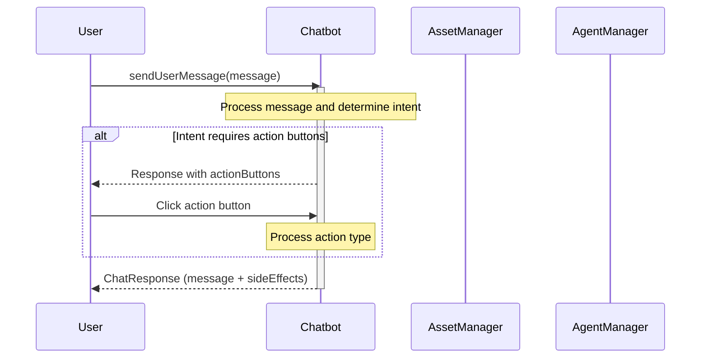
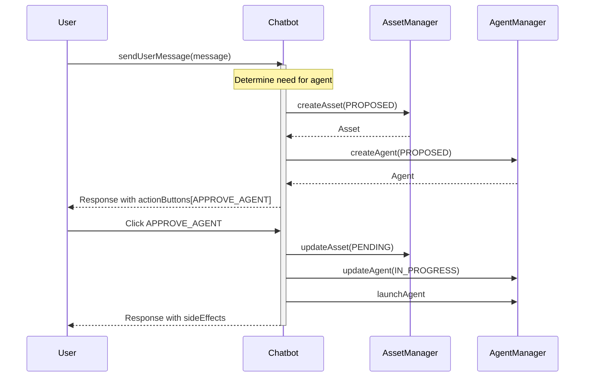
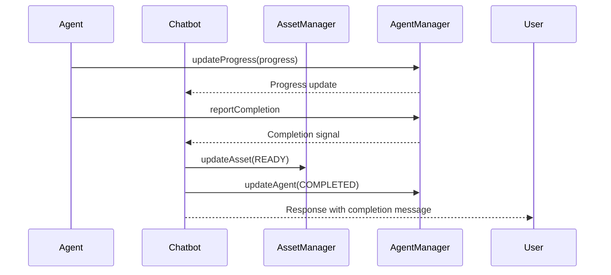
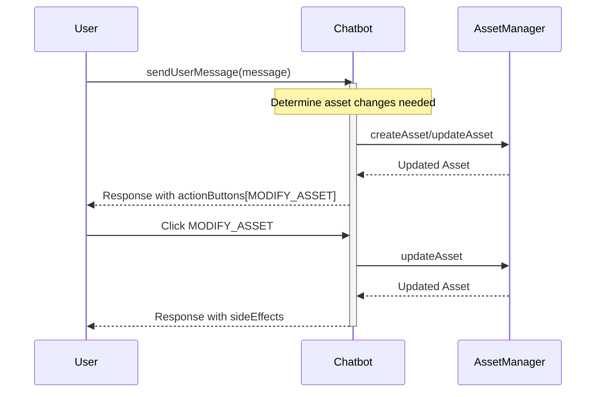
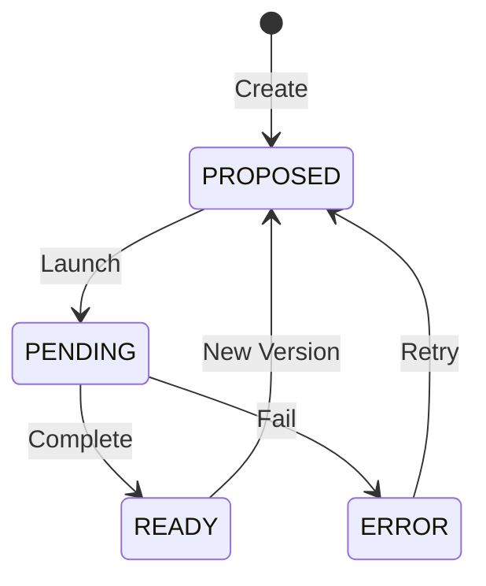
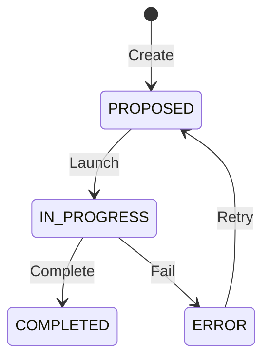

# FractalBot Sequence Diagrams

## Core Message Flow with Action Buttons

## Agent Proposal and Launch Flow

## Agent Execution and Completion Flow

## Asset Modification Flow

## State Machines

### Asset State Machine

### Agent State Machine

## Key Points

1. **Message Flow**
   - All user interactions start with a message
   - Chatbot may respond with action buttons
   - User can trigger actions through buttons
   - Responses include both messages and side effects

2. **Agent Lifecycle**
   - Agents start in PROPOSED state
   - User must approve before launch
   - Agents report progress during execution
   - Completion updates both agent and asset states

3. **Asset Lifecycle**
   - Assets track their status
   - Status changes reflect agent progress
   - Assets can be modified through user actions
   - Version control is supported

4. **Action Types**
   - APPROVE_AGENT: Launch a proposed agent
   - REJECT_AGENT: Cancel a proposed agent
   - LAUNCH_AGENT: Start agent execution
   - MODIFY_ASSET: Update asset content
   - NEXT_STEP: Progress workflow 