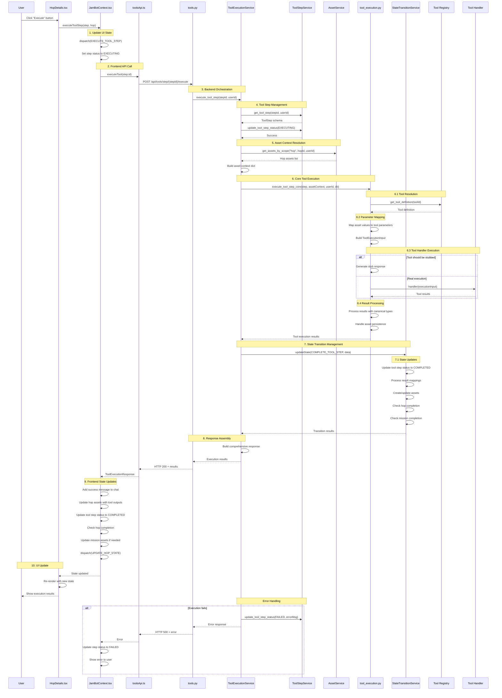

# Tool Execution Sequence Diagram

## Diagram Explanation

### Key Phases:

1. **User Interaction** (1): User initiates execution through UI
2. **Frontend State Management** (2): React context updates local state
3. **API Communication** (3): HTTP request to backend
4. **Backend Orchestration** (4-7): Services coordinate execution
5. **Tool Execution** (6): Core tool logic with parameter mapping and handler execution
6. **State Management** (7): Workflow state updates and completion checks
7. **Response Processing** (8-10): Results propagated back to frontend and UI

### Service Interactions:

- **ToolExecutionService**: Central orchestrator
- **ToolStepService**: Tool step database operations
- **AssetService**: Asset retrieval and management
- **StateTransitionService**: Workflow state transitions
- **Core Execution**: Tool parameter mapping and handler execution

### Error Flow:

The diagram includes error handling showing how failures are propagated back through the service layers and ultimately displayed to the user while maintaining state consistency.

### Key Benefits:

1. **Clear Separation**: Each service has distinct responsibilities
2. **Minimal Coupling**: Services interact through well-defined interfaces
3. **Error Isolation**: Failures don't cascade inappropriately
4. **State Consistency**: StateTransitionService ensures atomic updates
5. **Extensibility**: New tools can be added without changing the orchestration flow